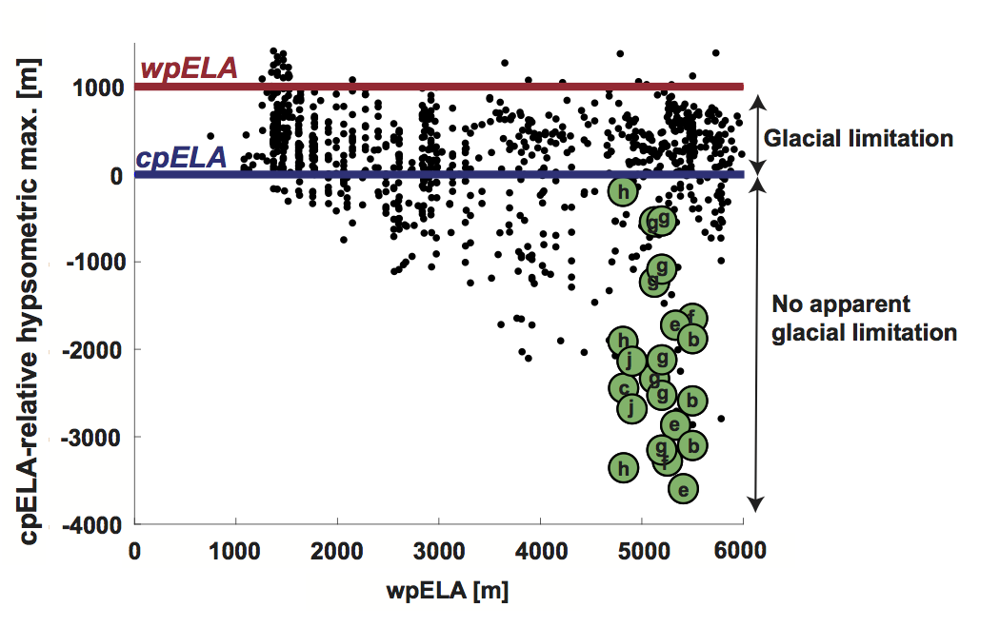
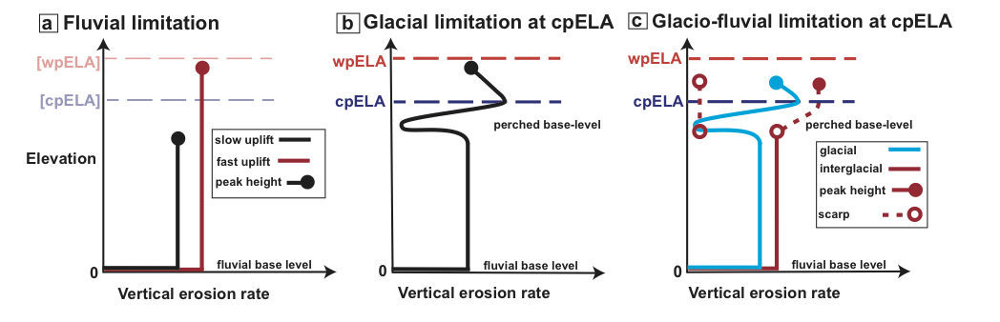

## Revealing how glacial erosion limits the height of tropical mountain ranges

Absent glacial erosion, mountain range height is limited by the 
rate of bedrock river incision, and is thought
to asymptote to a steady-state elevation as erosion and rock uplift rates converge. 
For glaciated mountains, there is evidence that range height 
is limited by glacial erosion rates, 
which vary cyclically with glaciations. The strongest evidence for glacial limitation 
is at mid-latitudes, where range-scale hypsometric maxima (modal elevations) lie within 
the bounds of late-Pleistocene snowline variation. In the tropics, where mountain 
glaciation is sparse, range elevation is generally considered to be fluvially limited
and glacial limitation is discounted. Here we present topographic evidence to the
contrary. By applying both old and new methods of hypsometric analysis to high
mountains in the tropics, we show that (a) the majority are subject to glacial 
erosion linked to a perched base-level set by the snowline or equilibrium line 
altitude (ELA), and (b) many truncate through glacial erosion towards the cold-phase
ELA. Evaluation of the hypsometric analyses at two field sites where glacial 
limitation is seemingly marginal reveals how glacio-fluvial processes act in 
tandem to accelerate erosion near the cold-phase ELA during warm phases and to
reduce their preservation potential. We conclude that glacial erosion truncates
high tropical mountains on a cyclic basis: zones of glacial erosion expand during 
cold periods, and contract during warm periods as fluvially-driven escarpments 
encroach and destroy evidence of glacial action. The inherent disequilibrium of
this glacio-fluvial limitation complicates the concept of time-averaged erosional
steady-state, making it meaningful only
on long time-scales far exceeding the interval between major glaciations.

Hypsometric maximum of glaciated 1°x1° SRTM tiles (adapted from Fig. 2 of 
Egholm et al., 2009, data provided courtesy of V. Pedersen). Each tile is plotted by its 
approximate warm-phase (modern) ELA (wpELA; x-axis) and its hypsometric maximum relative 
to (after subtraction by) the cold-phase ELA (cpELA; y-axis); zero on the y-axis 
therefore indicates a hypsometric maximum at the cpELA. Glacial limitation is inferred 
for all SRTM tiles with a hypsometric maximum between the wpELA and cpELA. The tiles of 
tropical mountain ranges analyzed in this study are in green and labeled according to the 
scheme used in Figs. 3 and 8: (a) Leuser Range, Aceh (omitted here); (b) Central Range, 
Taiwan; (c) Talamanca Range, Costa Rica; (d) Crocker Range, Borneo (omitted here); (e) 
Finisterre Range, Papua New Guinea; (f) Owen Stanley Range, Papua New Guinea; 
(g) Merauke Range, Papua; (h) Mérida Range, Venezuela; (i) Sierra Nevada de Santa Marta, 
Colombia (omitted here); (j) Rwenzori, East Africa. The Leuser Range, Crocker Range, 
and Santa Marta were not included in the analysis by Egholm et al., 2009.

Fluvial limitation: vertical erosion rate vs. elevation in steady state, 
fluvially-limited regime. Black line: slow rock uplift; red line: fast rock uplift. 
The rate of rock uplift sets steady-state peak elevations (closed circle) at different 
elevations. Warm-phase ELA (wpELA) and cold-phase ELA (cpELA) are indicated for reference,
 but are irrelevant in this scenario. (b) Glacial limitation, with glacial base-level 
 below the cpELA. Black line: erosion rate profile, with significant glacial influence 
 at high elevations. Peak elevations reach above the cpELA, but are tied to glacial 
 incision near this elevation. (c) Glacio-fluvial limitation. Blue line: erosion rate 
 profile during glacial periods, similar to (b). Red line: interglacial erosion rate 
 profile, characterized by headward migrating escarpment (along dashed line above erosion
  rate profile). During interglacials, erosion in previously glaciated landscapes is 
  ineffective (dashed line, left hand side). 

# Study sites

Seeking to broadly assess the potential for glacial limitation in
tropical mountain ranges, we reviewed all those ranges close to the
height of the cpELA. Within this broad selection, we sought a subset
uncontaminated by processes that would distort or complicate any signal
of glacial limitation. In particular, we wanted to avoid any confusion
between the passive uplift of low-relief terrain from that of *in-situ*
glacial erosion. The potential for such confusion is strongest in the
Peruvian/Bolivian Andes, the Sierra Madre of Mexico and Guatemala, the
central highlands of Papua New Guinea, all of which are characterized by
large, internally drained plateaus disconnected from external
base-level; as such, these regions were excluded from our analysis.
Volcanism is another complicating factor, in that glaciated volcanoes
have undergone a mix of construction and erosion that cannot easily be
disentangled. Therefore, glaciated volcanoes such as those in East
Africa (Mt. Kilimanjaro and Mt. Kenya) and Papua New Guinea (Mt. Giluwe)
were excluded from our analysis. A final constraint was that each range
must be circumferentially well-connected to external base-level
(sea-level or lake-level) by relatively short fluvial links.

The following ten tropical mountain ranges remain and were selected for
analysis:

1)  Leuser Range, Aceh, Indonesia

2)  Central Range, Taiwan

3)  Talamanca Range, Costa Rica

4)  Crocker Range, Borneo

5)  Finisterre Range, Papua New Guinea

6)  Owen Stanley Range, Papua New Guinea

7)  Merauke Range, Papua

8)  Mérida Range, Venezuela

9)  Sierra Nevada de Santa Marta, Colombia

10) Rwenzori, East Africa

