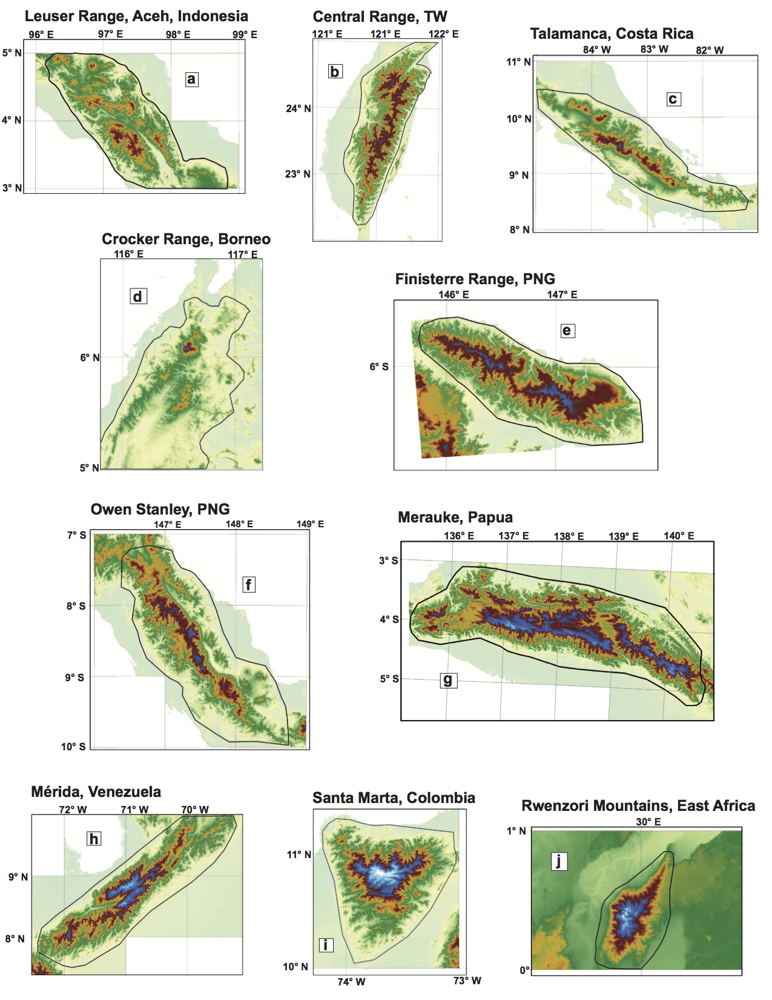

### Digital elevation model data used to assess glacial limitation

All topographic analysis was performed on 1-arcsecond (projected at 30 m resolution) 
Shuttle Radar Topography Mission (SRTM) digital topography (Farr et al., 2007). 
SRTM data were acquired using 
[U.S. Geological Survey Earth Explorer](https://earthexplorer.usgs.gov).

*SRTM DEMs of selected tropical mountain belts. Yellow-green through red spans elevations 
0-3400 m. Dark blue to light blue is 3400-4500 m (tropical cpELA to wpELA). Black polygons
circumscribing each range indicate bounds for hypsometric analysis*
