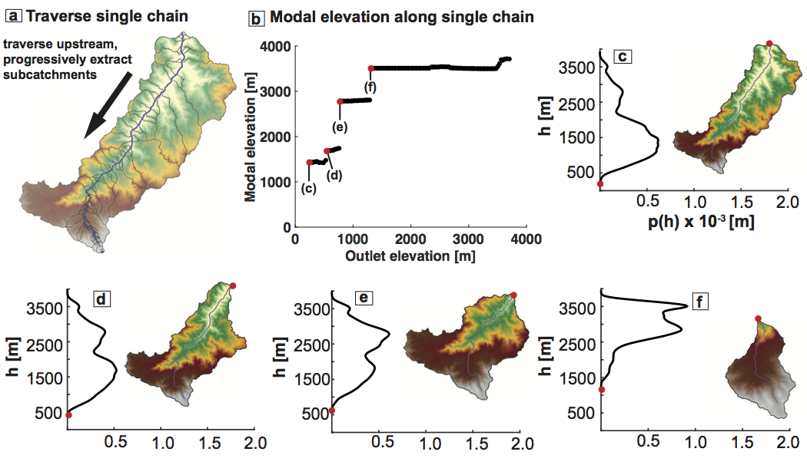
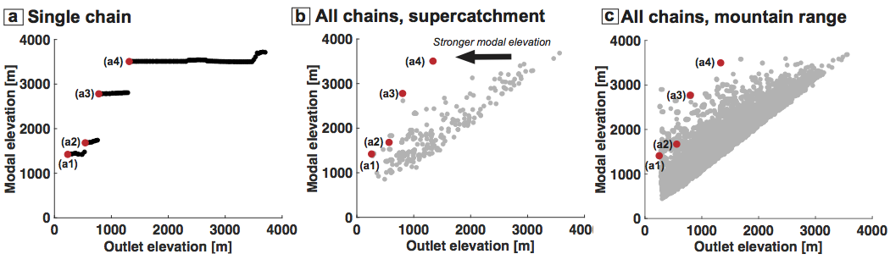

## How progressive hypsometry works

We designed an algorithm that concisely describes how hypsometry varies
with the scale of analysis. Development of this algorithm was motivated
by the observation that the hypsometric maximum of large regions can
shift by several kilometers depending on the boundaries of analysis. The
algorithm, which we term "progressive hypsometry," (PH) involves the
measurement of hypsometric maxima in nested catchments whose outlets
span from the lowest to the highest elevations in a mountain range.

### Algorithm

*Progressive hypsometry in detail. (a) DEM of one supercatchment from the Talamanca Range. 
Elevation 0-4000 m is yellow through white. The dark blue streamline is an example of one 
chain along which progressive hypsometry is performed. The bounds of each progressively 
delineated catchment are drawn in black. (b) Modal elevation (hypsometric maximum) of 
catchments draining to progressively higher outlet elevations along dark blue streamline 
in (a). Each subcatchment in (a) is represented on (b). The stepped pattern in catchment 
modal elevation is commonly observed in all landscapes. (c-f) Elevation pdf and DEM of 
catchments at each jump in modal elevation in (b). Red dots indicate the catchment outlet 
on both the pdf and DEM, and are also represented as red dots in (b).*

Progressive hypsometry consists of three major components:
(i) segmentation of the landscape into large catchments,
(ii) calculation of hypsometry along flow paths, (iii) segmentation
into nested subcatchments characterized by a shared modal elevation. We
first segment the targeted mountain range into large (1000
km2) catchments, hereafter referred to as "supercatchments",
delineated on the condition that they link the main divide to a low
reference elevation. This method typically segments each mountain range
into 30-60 supercatchments. We then do the following:

1.  Map channel network:
    
    1.  define a channel network in each supercatchment using an
        arbitrary flow accumulation area threshold *A\_c—*this thins the
        set of all possible flow paths
    
    2.  traverse downstream from each channel head *i=1…N* to the
        catchment exit to define a set of *N* along-channel pixel chains
    
    3.  extend each chain *i* upstream from its channel head to the
        drainage divide by following path of greatest flow accumulation
        area, ensuring that each pixel chain spans the full range of
        elevation from ridge to exit

2.  Map PH along network:
    
    4.  traverse each chain *i* upstream from the exit (shared by all
        chains)
    
    5.  map along each chain a nested series of subcatchments, one at
        every channel pixel *j(i)*
    
    6.  for each nested subcatchment, estimate its elevation pdf, its
        modal elevation *h\_mode\_j* (where the pdf peaks) and its
        outlet elevation *h\_out\_j*
    
    7.  record as a set of *i=1…N* sequences of
        *\[h\_out\_j(i),h\_mode\_j(i)\]* pairs

3.  Identify all PH "benches", characteristic nested-catchment modal
    elevations 
    
    8.  perform change-point detection along each chain *i=1…N* to
        locate and define large jumps in *h\_mode* at each *h\_out*
    
    9.  define the outlet elevation *h\_out* at each jump as *h\_change*
    
    10. designate the groups of between-jump modal elevations
        *{h\_mode}* as "benches"
    
    11. define each bench modal elevation *h\_bench = min{h\_mode}*
    
    12. record as a set of *i=1…N* sequences (one per chain) of
        *\[h\_change\_k(i),h\_bench\_k(i)\]* pairs, each of length
        *k(i)=1..n(i)*
    
    13. concatenate all *N* sequences of
        *\[h\_change\_k(i),h\_bench\_k(i)\] *

*Mapping single progressive hypsometry chains on the mountain range scale. 
(a) Same as previous figure (b). 
Modal elevation is calculated for subcatchments progressively 
extracted along single chain. (b) On the scale of a supercatchment 
(e.g., previous figure (a)), jumps 
in modal elevation for each chain are plotted corresponding to the outlet elevation at 
which the jump occurs (h_change). Red points are same as (a) and correspond with 
catchments in the previous figure (c-f). 
(c) Same as b, except for all chains in entire mountain 
range (Talamanca Range, Costa Rica).*

